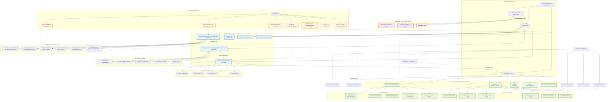

# Repo Architecture (Code Walkthrough)

```mermaid
graph TB
    subgraph "Main Repository Structure"
        A[AI-Maker-Space/How-to-Build-ChatGPT]
        A --> B[main branch]
        A --> C[feature/agents-sdk-research-agent]
        A --> D[feat/chatgpt-frontend]
    end

    subgraph "Main Branch - Educational Notebooks"
        B --> B1["OpenAI_Responses_API_No_Tooling.ipynb<br/>(627 lines)"]
        B --> B2["OpenAI_Responses_API_Data_and_Connectors.ipynb<br/>(1,403 lines)"]
        B --> B3["OpenAI_Agents_SDK.ipynb<br/>(732 lines)"]
        B --> B4["pyproject.toml<br/>(326 bytes)"]
        B --> B5["data/Embedding-Based.pdf"]
        B --> B6["README.md (1,449 bytes)"]
    end

    subgraph "Part 1: Responses API Evolution"
        B1 --> B1a["Basic Response Generation<br/>(developer/user/assistant)"]
        B1 --> B1b["Reasoning Control<br/>(low/medium/high/minimal)"]
        B1 --> B1c["Structured Outputs<br/>(Native Pydantic)"]
        B1 --> B1d["Multimodal Inputs<br/>(Text + Images)"]
        B1 --> B1e["Streaming Support<br/>(Including structured)"]
        B1 --> B1f["Context Engineering<br/>(Instructions vs Developer Role)"]
    end

    subgraph "Part 2: RAG & Connectors"
        B2 --> B2a[Vector Search Implementation]
        B2 --> B2b[Google Calendar Connector]
        B2 --> B2c[GitMCP Server Integration]
        B2 --> B2d[File Processing Pipeline]
        B2 --> B2e[Citation System]
    end

    subgraph "Part 3: Multi-Agent Systems"
        B3 --> B3a[Agent Orchestration]
        B3 --> B3b[Async Processing]
        B3 --> B3c[MCP Integration]
        B3 --> B3d[Runner Patterns]
    end

    subgraph "Agents SDK Branch - Same as Main"
        C --> C1["Same notebook structure as main"]
        C --> C2["No additional production code"]
        C --> C3["Educational focus"]
    end

    subgraph "Frontend Branch - Production Application"
        D --> D1["frontend/ - Next.js App"]
        D --> D2["api/app.py<br/>(548 lines FastAPI)"]
        D --> D3["test_api.py<br/>(165 lines)"]
        D --> D4["setup.sh + DEPLOYMENT.md"]
        D --> D5["vercel.json + package.json"]
    end

    subgraph "Frontend Architecture"
        D1 --> D1a["pages/index.js<br/>(500+ lines React)"]
        D1 --> D1b["Real-time streaming UI"]
        D1 --> D1c["Multi-file upload system"]
        D1 --> D1d["React hooks state management"]
        D1 --> D1e["Next.js 14.2.0 + React 18.2.0"]
    end

    subgraph "Backend Architecture"
        D2 --> D2a["/api/chat (lines 89-220)"]
        D2 --> D2b["/api/upload-file (lines 379-430)"]
        D2 --> D2c["/api/research (lines 299-323)"]
        D2 --> D2d["/api/health + /api/clear-session"]
        D2 --> D2e["Vector store integration"]
        D2 --> D2f["Streaming responses"]
    end

    subgraph "Actual Technology Stack"
        E[Tech Stack] --> E1["OpenAI Responses API<br/>+ Assistants API fallback"]
        E --> E2["Pydantic BaseModel<br/>for structured I/O"]
        E --> E3["OpenAI Vector Stores<br/>+ File Search"]
        E --> E4["FastAPI with CORS<br/>+ async streaming"]
        E --> E5["Next.js 14.2.0<br/>+ React 18.2.0"]
        E --> E6["MCP Connectors<br/>(Google Calendar + GitMCP)"]
        E --> E7["Agents SDK<br/>+ asyncio orchestration"]
    end

    %% Technology connections to implementations
    E1 -.-> B1
    E2 -.-> B1c
    E3 -.-> B2a
    E4 -.-> D2
    E5 -.-> D1
    E6 -.-> B3c
    E7 -.-> B3b

    %% Evolution path
    B1 -->|"Part 1: Basic API"| B2
    B2 -->|"Part 2: RAG + MCP"| B3
    B3 -->|"Part 3: Multi-Agent"| D
    C -.->|"Same educational content"| B
    D -->|"Part 4: Production"| F["Deployable ChatGPT Clone"]

    %% Architectural patterns
    G[Implementation Patterns] --> G1["Educational → Production"]
    G --> G2["Notebooks → Full Stack"]
    G --> G3["Streaming Responses"]
    G --> G4["File + Vector Search"]
    G --> G5["Session Management"]

    G1 -.-> D
    G2 -.-> D1a
    G3 -.-> D2f
    G4 -.-> D2e
    G5 -.-> D2d

    classDef notebook fill:#e3f2fd,stroke:#1976d2,stroke-width:2px
    classDef agent fill:#f3e5f5,stroke:#7b1fa2,stroke-width:2px
    classDef frontend fill:#e8f5e8,stroke:#388e3c,stroke-width:2px
    classDef tech fill:#fff3e0,stroke:#f57c00,stroke-width:2px

    class B1,B2,B3,B4,B5,B6 notebook
    class C1,C2,C3 agent
    class D1,D2,D3,D4,D5,D1a,D1b,D1c,D1d,D1e,D2a,D2b,D2c,D2d,D2e,D2f frontend
    class E1,E2,E3,E4,E5,E6,E7 tech
```