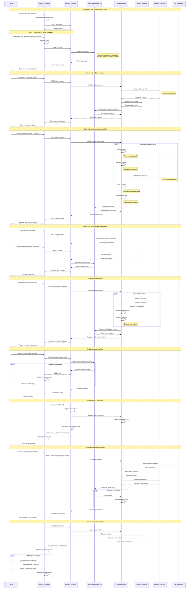

# End-to-End Sequence

```mermaid
sequenceDiagram
    participant User
    participant Frontend as Next.js Frontend
    participant Backend as FastAPI Backend
    participant Responses as OpenAI Responses API
    participant Agents as Agent System
    participant VectorDB as Vector Database
    participant External as External Services
    participant MCP as MCP Servers

    Note over User, MCP: Complete ChatGPT Application Flow

    %% User Interaction Initiation
    User->>Frontend: Opens ChatGPT interface
    Frontend->>Frontend: Initialize React components
    Frontend->>Backend: GET /api/health
    Backend-->>Frontend: System ready

    %% Part 1: Basic Prompting Flow
    Note over User, Backend: Part 1 - Prompting & Responses API

    User->>Frontend: Types message: "Explain quantum computing"
    Frontend->>Frontend: Validate input
    Frontend->>Backend: POST /api/chat

    Backend->>Responses: responses.create()
    Note right of Responses: reasoning={"effort": "medium"}<br/>instructions="Be clear and concise"

    Responses-->>Backend: Streaming response
    Backend-->>Frontend: Server-sent events
    Frontend-->>User: Real-time response display

    %% Part 2: RAG Enhancement Flow
    Note over User, MCP: Part 2 - RAG & Connectors

    User->>Frontend: "What's in my calendar today?"
    Frontend->>Backend: POST /api/research

    Backend->>Agents: Initialize calendar agent
    Agents->>External: Google Calendar API
    Note right of External: OAuth authentication
    External-->>Agents: Calendar events

    Agents->>VectorDB: Store/retrieve context
    VectorDB-->>Agents: Relevant information

    Agents->>Responses: Enhanced prompt with context
    Responses-->>Agents: Contextual response
    Agents-->>Backend: Enriched response
    Backend-->>Frontend: Response with citations
    Frontend-->>User: Calendar-aware response

    %% Part 3: Multi-Agent Coordination
    Note over User, MCP: Part 3 - Agentic Search & Agents SDK

    User->>Frontend: "Prepare me for tomorrow's meeting"
    Frontend->>Backend: POST /api/research

    Backend->>Agents: Initialize agent orchestrator

    par Parallel Agent Execution
        Agents->>Agents: Calendar Agent
        Note right of Agents: Fetch meeting details
        and
        Agents->>Agents: Research Agent
        Note right of Agents: Background research
        and
        Agents->>External: Web search via MCP
        Note right of External: Real-time information
    end

    Agents->>Agents: Event Analyzer
    Note right of Agents: Process all gathered data

    Agents->>Agents: Preparation Guide
    Note right of Agents: Generate action items

    Agents->>Responses: Synthesized prompt
    Responses-->>Agents: Comprehensive response
    Agents-->>Backend: Meeting preparation
    Backend-->>Frontend: Structured response
    Frontend-->>User: Meeting brief + action items

    %% Part 4: File Upload and Processing
    Note over User, MCP: Part 4 - File Processing & Deployment

    User->>Frontend: Upload PDF document
    Frontend->>Backend: POST /api/upload-file

    Backend->>VectorDB: Process and embed document
    VectorDB-->>Backend: Embedding confirmation

    User->>Frontend: "Summarize the uploaded document"
    Frontend->>Backend: POST /api/chat

    Backend->>VectorDB: Semantic search
    VectorDB-->>Backend: Relevant chunks

    Backend->>Responses: Document-aware prompt
    Responses-->>Backend: Document summary
    Backend-->>Frontend: Summary with citations
    Frontend-->>User: Document analysis

    %% Error Handling and Resilience
    Note over User, MCP: Error Handling Patterns

    User->>Frontend: Complex multi-modal request
    Frontend->>Backend: POST /api/chat (with images)

    Backend->>Agents: Multi-modal processing

    alt Service Available
        Agents->>External: External API call
        External-->>Agents: Success response
    else Service Unavailable
        Agents->>Agents: Circuit breaker triggered
        Agents->>Agents: Fallback strategy
        Note right of Agents: Graceful degradation
    end

    Agents->>Responses: Process with fallback context
    Responses-->>Agents: Best-effort response
    Agents-->>Backend: Response with service status
    Backend-->>Frontend: Response + health indicators
    Frontend-->>User: Response with transparency

    %% Streaming and Real-time Updates
    Note over User, MCP: Real-time Streaming Flow

    User->>Frontend: Long-form generation request
    Frontend->>Backend: POST /api/chat (stream=true)

    Backend->>Responses: responses.create(stream=True)

    loop Streaming Response
        Responses-->>Backend: Partial response chunk
        Backend-->>Frontend: SSE chunk
        Frontend->>Frontend: Update UI incrementally
        Frontend-->>User: Real-time text display
    end

    Responses-->>Backend: Stream complete
    Backend-->>Frontend: Completion signal
    Frontend-->>User: Final formatting

    %% Performance Monitoring
    Note over User, MCP: Observability & Monitoring

    Frontend->>Backend: Request with trace ID
    Backend->>Backend: Log request metrics

    Backend->>Agents: Process with monitoring
    Agents->>Agents: Track agent performance

    Backend->>Backend: Aggregate performance data
    Backend-->>Frontend: Response + performance metadata

    Frontend->>Frontend: Client-side analytics
    Frontend-->>User: Optimized experience

    %% Advanced Features Integration
    Note over User, MCP: Advanced Integration Patterns

    User->>Frontend: "Create a presentation about X"
    Frontend->>Backend: POST /api/research (complex task)

    Backend->>Agents: Multi-step workflow

    Agents->>MCP: Content research via MCP
    MCP-->>Agents: Structured data

    Agents->>VectorDB: Knowledge retrieval
    VectorDB-->>Agents: Relevant context

    Agents->>External: Template generation
    External-->>Agents: Presentation structure

    Agents->>Responses: Multi-part generation

    loop Content Generation
        Responses-->>Agents: Slide content
        Agents->>Agents: Structure and format
    end

    Agents-->>Backend: Complete presentation
    Backend-->>Frontend: Structured deliverable
    Frontend-->>User: Downloadable presentation

    %% System Health and Maintenance
    Note over User, MCP: System Maintenance Flow

    Frontend->>Backend: Periodic health check
    Backend->>Agents: Agent system status
    Backend->>VectorDB: Database health
    Backend->>External: External service status
    Backend->>MCP: MCP server connectivity

    Backend-->>Frontend: Comprehensive health report
    Frontend->>Frontend: Update system indicators

    alt All Systems Healthy
        Frontend-->>User: Full functionality available
    else Degraded Performance
        Frontend-->>User: Limited functionality notice
        Frontend->>Frontend: Enable fallback modes
    end
```