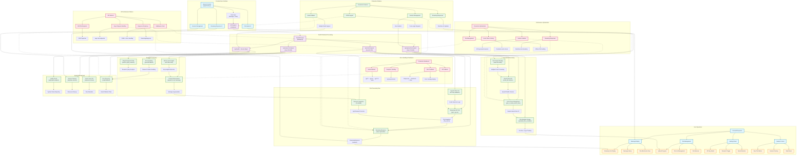

# Runner → Tasks → Outputs

```mermaid
graph TB
    subgraph "Frontend User Interface"
        A["Next.js Frontend<br/>(pages/index.js)"] --> B["User Input<br/>(Message + Files)"]
        B --> C["API Request<br/>to Backend"]
        A --> A1["File Upload UI"]
        A --> A2["Streaming Response UI"]
        A --> A3["Session Management"]
    end

    subgraph "FastAPI Backend Processing"
        C --> D["FastAPI Router<br/>(api/app.py)"]
        D --> E["/api/chat Endpoint<br/>(lines 89-220)"]
        D --> F["/api/upload-file Endpoint<br/>(lines 379-430)"]
        D --> G["/api/research Endpoint<br/>(lines 299-323)"]
        D --> H["/api/health + Session Mgmt"]
    end

    subgraph "Chat Processing Flow"
        E --> E1["OpenAI Client Init<br/>(API Key Validation)"]
        E --> E2["Research Integration<br/>(if enabled)"]
        E --> E3["Responses API Call<br/>(gpt-5, gpt-4o)"]
        E --> E4["Streaming Response<br/>(async generator)"]
        E1 --> E1a["Model Selection Logic"]
        E2 --> E2a["Light Research Function"]
        E3 --> E3a["Tool Integration<br/>(file_search)"]
        E4 --> E4a["StreamingResponse<br/>(FastAPI)"]
    end

    subgraph "File Upload Processing"
        F --> F1["File Content Reading<br/>(await file.read())"]
        F --> F2["OpenAI Files API<br/>(create_file function)"]
        F --> F3["Vector Store Management<br/>(get_or_create_vector_store)"]
        F --> F4["File Metadata Storage<br/>(uploaded_files_metadata)"]
        F1 --> F1a["Multipart Form Processing"]
        F2 --> F2a["BytesIO Buffer Creation"]
        F3 --> F3a["Session-based Store ID"]
        F4 --> F4a["File Size + Type Tracking"]
    end

    subgraph "Research Processing"
        G --> G1["Simple Research Mode<br/>(perform_light_research)"]
        G --> G2["GPT-4o-mini Insights<br/>(500 token limit)"]
        G --> G3["Context Enhancement<br/>(append to user message)"]
        G --> G4["Error Handling<br/>(graceful fallback)"]
        G1 --> G1a["Research Query Analysis"]
        G2 --> G2a["Key Insights Extraction"]
        G3 --> G3a["Message Augmentation"]
        G4 --> G4a["Research Failure Handling"]
    end

    subgraph "System Management"
        H --> H1["Health Check<br/>(/api/health endpoint)"]
        H --> H2["Session Cleanup<br/>(/api/clear-session)"]
        H --> H3["Vector Store Info<br/>(/api/vector-stores)"]
        H --> H4["Error Recovery<br/>(model fallback)"]
        H1 --> H1a["System Status Reporting"]
        H2 --> H2a["Resource Cleanup"]
        H3 --> H3a["Store Metadata"]
        H4 --> H4a["Model Fallback Chain"]
    end

    subgraph "Production Patterns"
        I["Production Features"] --> I1["Streaming Responses"]
        I --> I2["Session Management"]
        I --> I3["Model Fallback"]
        I --> I4["CORS Support"]

        I1 --> I1a["Real-time UI Updates"]
        I2 --> I2a["User Isolation"]
        I3 --> I3a["Multiple Model Support"]
        I4 --> I4a["Cross-origin Requests"]
    end

    subgraph "User Experience"
        J["Frontend Response"] --> J1["Message Display"]
        J --> J2["File Management"]
        J --> J3["Settings Panel"]
        J --> J4["Session Control"]

        J1 --> J1a["Streaming Text Display"]
        J1 --> J1b["Message History"]
        J1 --> J1c["File Attachments View"]

        J2 --> J2a["Upload Progress"]
        J2 --> J2b["File List Management"]
        J2 --> J2c["File Removal"]

        J3 --> J3a["API Key Modal"]
        J3 --> J3b["Research Toggle"]
        J3 --> J3c["Model Selection"]

        J4 --> J4a["New Chat Button"]
        J4 --> J4b["Session Clearing"]
        J4 --> J4c["State Reset"]
    end

    %% Production Flow Connections
    A1 --> F1
    A2 --> E4a
    A3 --> H2

    E1a --> E3
    E2a --> E3a
    E3a --> E4
    E4a --> J1a

    F1a --> F2
    F2a --> F3
    F3a --> F4
    F4a --> J2a

    G2a --> G3
    G3a --> E2
    G4a --> H4

    %% Production Integration
    I1 -.-> E4
    I2 -.-> F3
    I3 -.-> H4
    I4 -.-> C
    I1a --> J1
    I2a --> F
    I3a --> H

    subgraph "API Architecture Patterns"
        K["API Patterns"] --> K1["RESTful Endpoints"]
        K --> K2["Async Request Handling"]
        K --> K3["Middleware Stack"]
        K --> K4["Response Streaming"]

        K1 --> K1a["POST /api/chat"]
        K2 --> K2a["async def endpoints"]
        K3 --> K3a["CORS + Error Handling"]
        K4 --> K4a["StreamingResponse"]
    end

    subgraph "Error Handling & Resilience"
        L["Production Resilience"] --> L1["Model Fallback"]
        L --> L2["Exception Handling"]
        L --> L3["API Fallback"]
        L --> L4["User Feedback"]

        L1 --> L1a["gpt-5 → gpt-4o → gpt-3.5-turbo"]
        L2 --> L2a["try/except blocks"]
        L3 --> L3a["Responses → Assistants → Chat"]
        L4 --> L4a["Error message display"]
    end

    subgraph "Performance Optimization"
        M["Production Optimization"] --> M1["Session Isolation"]
        M --> M2["Vector Store Caching"]
        M --> M3["Streaming Responses"]
        M --> M4["File Management"]

        M1 --> M1a["API key-based sessions"]
        M2 --> M2a["Persistent vector stores"]
        M3 --> M3a["Real-time text streaming"]
        M4 --> M4a["Efficient file handling"]
    end

    %% Pattern Applications
    K2 -.-> E
    K3 -.-> D
    K4 -.-> E4
    L1 -.-> H4
    L3 -.-> E3
    M1 -.-> F3
    M3 -.-> E4
    M4 -.-> F

    classDef frontend fill:#e1f5fe,stroke:#0277bd,stroke-width:2px
    classDef backend fill:#f3e5f5,stroke:#7b1fa2,stroke-width:2px
    classDef process fill:#e8f5e8,stroke:#388e3c,stroke-width:2px
    classDef ui fill:#fff3e0,stroke:#f57c00,stroke-width:2px
    classDef pattern fill:#fce4ec,stroke:#c2185b,stroke-width:2px

    class A,A1,A2,A3,J,J1,J2,J3,J4 frontend
    class C,D,E,F,G,H backend
    class E1,E2,E3,E4,F1,F2,F3,F4,G1,G2,G3,G4,H1,H2,H3,H4,I,I1,I2,I3,I4 process
    class J1a,J1b,J1c,J2a,J2b,J2c,J3a,J3b,J3c,J4a,J4b,J4c ui
    class K,K1,K2,K3,K4,L,L1,L2,L3,L4,M,M1,M2,M3,M4 pattern
```