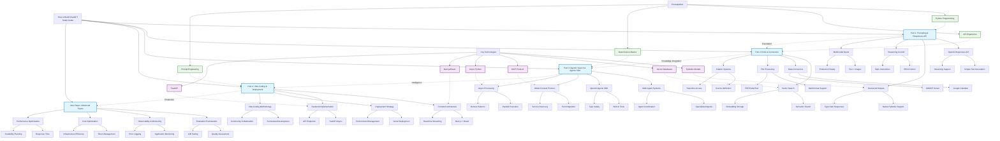

# Study Guide Concept Map

```mermaid
graph TD
    A[How to Build ChatGPT<br/>Study Guide] --> B[Part 1: Prompting & Responses API]
    A --> C[Part 2: RAG & Connectors]
    A --> D[Part 3: Agentic Search & Agents SDK]
    A --> E[Part 4: Vibe-Coding & Deployment]
    A --> F[Next Steps: Advanced Topics]

    B --> B1[OpenAI Responses API]
    B --> B2[Structured Outputs]
    B --> B3[Reasoning Control]
    B --> B4[Multimodal Inputs]

    B1 --> B1a[Simple Text Generation]
    B1 --> B1b[Streaming Support]
    B2 --> B2a[Native Pydantic Support]
    B2 --> B2b[Type-Safe Responses]
    B3 --> B3a[Effort Control]
    B3 --> B3b[Style Instructions]
    B4 --> B4a[Text + Images]
    B4 --> B4b[Production Ready]

    C --> C1[Vector Search]
    C --> C2[Data Connectors]
    C --> C3[File Processing]
    C --> C4[Citation Systems]

    C1 --> C1a[Semantic Search]
    C1 --> C1b[Embedding Storage]
    C2 --> C2a[Google Calendar]
    C2 --> C2b[GitMCP Server]
    C3 --> C3a[Multi-format Support]
    C3 --> C3b[PDF/Code/Text]
    C4 --> C4a[Source Attribution]
    C4 --> C4b[Real-time Access]

    D --> D1[Multi-Agent Systems]
    D --> D2[OpenAI Agents SDK]
    D --> D3[Model Context Protocol]
    D --> D4[Async Processing]

    D1 --> D1a[Specialized Agents]
    D1 --> D1b[Agent Coordination]
    D2 --> D2a[Built-in Tools]
    D2 --> D2b[Type Safety]
    D3 --> D3a[Tool Integration]
    D3 --> D3b[Service Discovery]
    D4 --> D4a[Parallel Execution]
    D4 --> D4b[Runner Patterns]

    E --> E1[Frontend Architecture]
    E --> E2[Backend Implementation]
    E --> E3[Deployment Strategy]
    E --> E4[Vibe Coding Methodology]

    E1 --> E1a[Next.js + React]
    E1 --> E1b[Real-time Streaming]
    E2 --> E2a[FastAPI Async]
    E2 --> E2b[API Endpoints]
    E3 --> E3a[Vercel Deployment]
    E3 --> E3b[Environment Management]
    E4 --> E4a[AI-Assisted Development]
    E4 --> E4b[Community Collaboration]

    F --> F1[Evaluation Frameworks]
    F --> F2[Observability & Monitoring]
    F --> F3[Cost Optimization]
    F --> F4[Performance Optimization]

    F1 --> F1a[Quality Assessment]
    F1 --> F1b[A/B Testing]
    F2 --> F2a[Application Monitoring]
    F2 --> F2b[Error Logging]
    F3 --> F3a[Token Management]
    F3 --> F3b[Infrastructure Efficiency]
    F4 --> F4a[Response Time]
    F4 --> F4b[Scalability Planning]

    %% Learning Path Flow
    B -.->|Foundation| C
    C -.->|Knowledge Integration| D
    D -.->|Intelligence| E
    E -.->|Production| F

    %% Key Technologies
    G[Key Technologies] --> G1[Pydantic Models]
    G --> G2[Vector Databases]
    G --> G3[MCP Protocol]
    G --> G4[Async Python]
    G --> G5[Next.js/React]
    G --> G6[FastAPI]

    G1 -.-> B2
    G2 -.-> C1
    G3 -.-> D3
    G4 -.-> D4
    G5 -.-> E1
    G6 -.-> E2

    %% Prerequisites
    H[Prerequisites] --> H1[Python Programming]
    H --> H2[API Experience]
    H --> H3[Data Science Basics]
    H --> H4[Prompt Engineering]

    H1 -.-> B
    H2 -.-> C
    H3 -.-> D
    H4 -.-> E

    classDef partStyle fill:#e1f5fe,stroke:#0277bd,stroke-width:2px
    classDef techStyle fill:#f3e5f5,stroke:#7b1fa2,stroke-width:2px
    classDef prereqStyle fill:#e8f5e8,stroke:#388e3c,stroke-width:2px

    class B,C,D,E,F partStyle
    class G1,G2,G3,G4,G5,G6 techStyle
    class H1,H2,H3,H4 prereqStyle
```